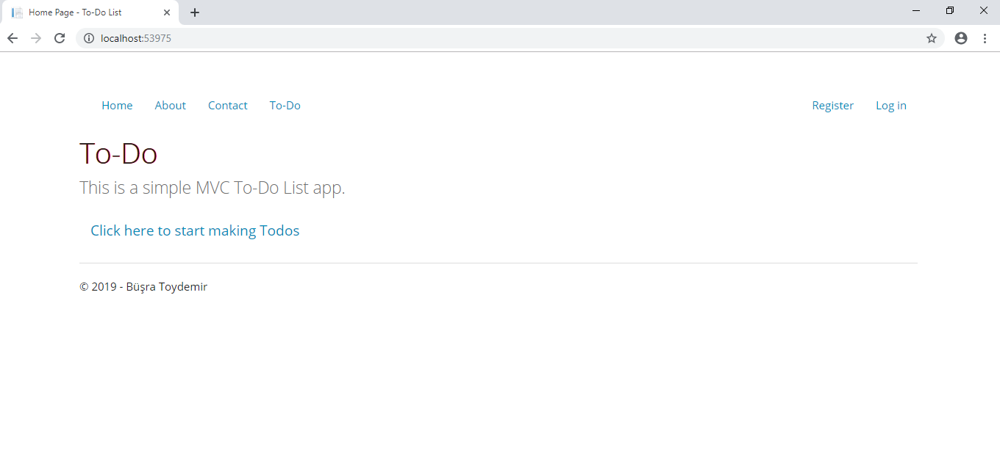

#To-Do List App
This is a simple MVC To-Do List app.

---
languages:
- csharp
---

## Technologies used
- ASP.NET MVC 5
- .NET 4.5
- Entity Framework
- MSSQL

##Running This Sample

1. Before you can run this sample, you must have the following prerequisites: -Visual Studio

2. Clone this repository using Git for Windows or download the zip file.

3. From Visual Studio, open the mvcToDoList.sln file from the root directory.

4. In Visual Studio Build menu, select Build Solution (or Press F6).

5. You can now run and debug the application locally by pressing F5 in Visual Studio.

